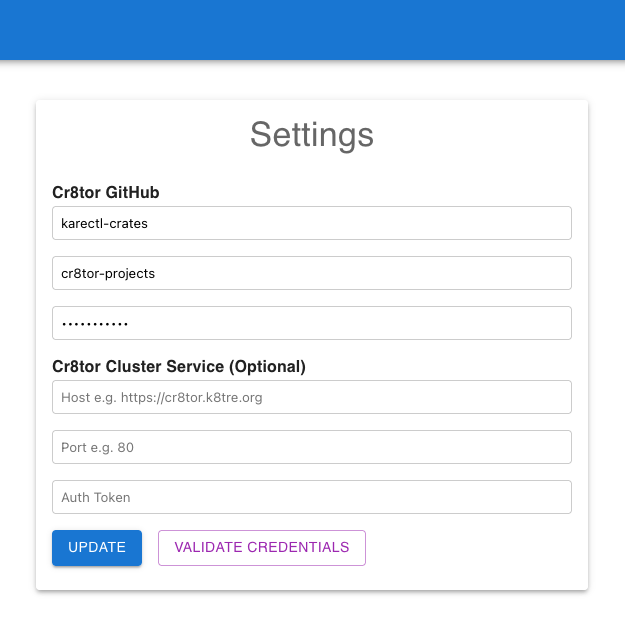
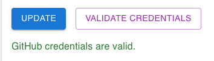

# Cr8tor WebUI
Cr8tor WebUI provides a web app for organisations to create Cr8tor projects. 

## QuickStart

To download and run the app:
- Install Docker Desktop for [Windows](https://docs.docker.com/desktop/setup/install/windows-install/) or [MacOS](https://docs.docker.com/desktop/setup/install/mac-install/)

- Open terminal and run:

    ```bash
    docker run -p 8000:8000 ghcr.io/karectl-crates/cr8tor-webui/cr8tor-webui:v0.0.2
    ```
- Open a web browser:
    ```bash
    http://localhost:8000
    ```
    

- In the settings pane, Configure the web app to access the github repository your organisation has set up to manage cr8tor projects e.g.:

    

The github token provided should be a PAT token with permissions to raise pull requests on the projects repository.

- Click update and test the details provided via 'Validate Credentials', you should see:

    

- Go to 'Create Project' to complete the web forms. 